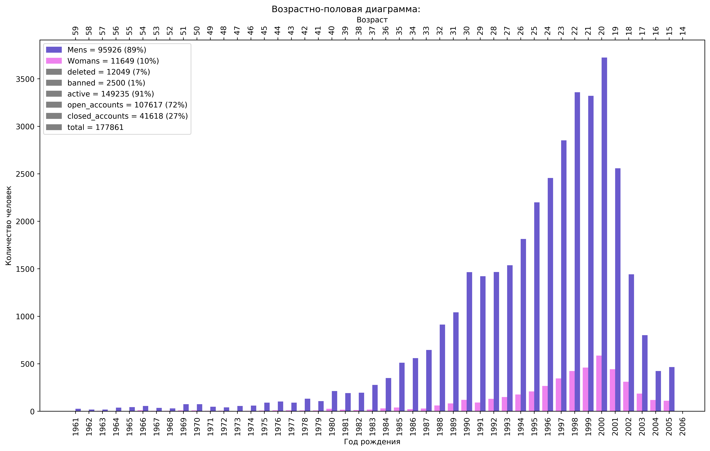

# vk_api_tpu
# Design and implement the function of a VK community “demographic portrait”

## vk.com community members sex and age distribution demographic portrait

** Design and implement the function of a VK community “demographic portrait” forming as an input parameter. The function should accept the identifier of the VK group. The output should contain: **

Design and implement the function of a VK community “demographic portrait” forming as an input parameter. The function should accept the identifier of the VK group. The output should contain: 
1.	The number of community members
2.	The average age of community members. Median age of community members. Percentage of users 
with no information about age. 
3.	Gender of community members: percentage of men, women, participants who did not indicate 
gender. 
4.	Place of residence - country, city. Percentage of users who did not indicate their place of residence. 
The result should be displayed in tables and graphs.

Example:

#### Launch
+ Install packages from `requirements.txt`
+ Replace templates in `secret.json` на свои логин и пароль
+ Enter a short link to the community or user in the TARGET variable
+ Launch
+ The data and graph will be saved in the same directory in a folder of the same name as TARGET

Note: Yes, entering your username and password is not the best method, but it is the easiest.

#### Functions

The class is divided into 4 main functions:

+ *get_members_ids* - gets the ids of all community members or the user’s friends

+ *get_users_data* - gets data about the age and gender of these ids

Because VK has a limit on the number of API method calls per day. It will be possible to analyze communities with a huge number of users no more than a couple of times a day. Therefore, to save requests, data about participant ids and additional fields are saved as json in the same folder. After saving the data, I recommend turning off the *get_members_ids* and *get_users_data* calls

+ *calculate* - calculates various parameters about users, change at your discretion
+ *make_plot* - builds a histogram of distribution by gender and age

A short link to the community or user id is suitable as a TARGET. Don't forget to change type group_members / user_friends
